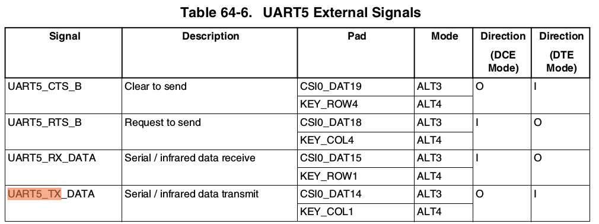

# More UARTs

## Additional UART


**References:**

\[1\] [http://variwiki.com/index.php?title=VAR-SOM-MX6\_UART](http://variwiki.com/index.php?title=VAR-SOM-MX6_UART)


By default, the DART-MX6 is configured for 3 UARTs. Namely, UART1 \(ttymxc1\), UART2 \(ttymxc2\) and UART3 \(ttymxc3\). The forth UART port can be configured via pin muxing by following [Variscite instrutions](http://variwiki.com/index.php?title=VAR-SOM-MX6_UART).

Edit arch/arm/boot/dts/imx6qdl-var-dart.dtsi

Look for:

```text
/* ttymxc2 UART */
&uart3 {
        pinctrl-names = "default";
        pinctrl-0 = <&pinctrl_uart3_2>;
        fsl,uart-has-rtscts;
        status = "okay";
};
```

and add the following below it,

```text
&uart4 {
        pinctrl-names = "default";
        pinctrl-0 = <&pinctrl_uart4_1>;
        status = "okay";
};
```

Similarly, look for

```text
        /* Variscite Uart3 support */
        pinctrl_uart3_2: uart3grp-2 {       /* RX/TX RTS/CTS */
                fsl,pins = <
                        MX6QDL_PAD_EIM_D25__UART3_RX_DATA     0x1b0b1
                        MX6QDL_PAD_EIM_D24__UART3_TX_DATA     0x1b0b1
                        MX6QDL_PAD_EIM_D23__UART3_CTS_B       0x1b0b1
                        MX6QDL_PAD_EIM_EB3__UART3_RTS_B       0x1b0b1
                >;
        };
```

and add the following below it,

```text
        /* Variscite Uart4 support */
        pinctrl_uart4_1: uart4grp-1 {       /* RX/TX */
                fsl,pins = <
                        MX6QDL_PAD_KEY_ROW0__UART4_RX_DATA    0x1b0b1
                        MX6QDL_PAD_KEY_COL0__UART4_TX_DATA    0x1b0b1
                >;
        };
```

To apply the changes, continue following the "Build Linux from source code" guide to build only the device trees and to copy them to your SD card.

## Updating the DTB

Copy the dart.dtb from the ~/imx6\_ws/var\_som\_mx6\_ubuntu/output to the device

Mount the boot partition 

Copy to the boot partition, and reboot.

## Example: UART5

Edit `arch/arm/boot/dts/imx6qdl-var-dart.dtsi`, and add the following

```text
/* ttymxc4 UART */
&uart5 {
        pinctrl-names = "default";
        pinctrl-0 = <&pinctrl_uart4_1>;
        fsl,uart-has-rtscts;
        status = "okay";
};
```

```text
        /* Variscite Uart4 support */
        pinctrl_uart4_1: uart4grp-1 {       /* RX/TX */
                fsl,pins = <
                        MX6QDL_PAD_KEY_ROW0__UART4_RX_DATA    0x1b0b1
                        MX6QDL_PAD_KEY_COL0__UART4_TX_DATA    0x1b0b1
                >;
        };
```

To figure what to label within `fsl,pins = < >;` , refer the i.MX 6Dual/6Quad Applications Processor Reference Manual

1. Note the Pin Mux Mode indicated in the DART-MX6 Datasheet. For UART5, the pins need to be muxed to **MODE 4**. 

   

2. Note the pad name referred in the UARTX External Signal. For UART5, the pad for CTS/RTS/RX/TX are **KEY\_ROW4/KEY\_COL4/KEY\_ROW1/KEY\_COL1**. 

   

3. Refer to `src/kernel/arch/arm/boot/dts/imx6q-pinfunc.h`, and find the full name for the UARTX pads. For UART5, the pads are
4. ```text
   /* there might be multiple results if you perform a simple search,
   but use the pad names identified in Step 2 to help spot the correct one */
   MX6QDL_PAD_KEY_ROW1__UART5_RX_DATA
   MX6QDL_PAD_KEY_COL1__UART5_TX_DATA
   MX6QDL_PAD_KEY_ROW4__UART5_CTS_B
   MX6QDL_PAD_KEY_COL4__UART5_RTS_B
   ```

