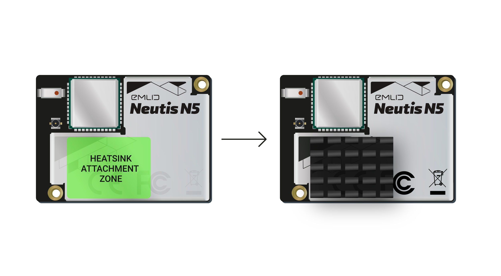
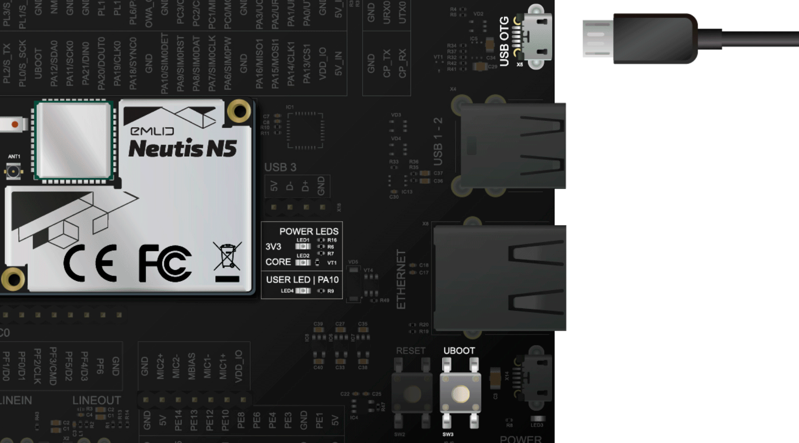
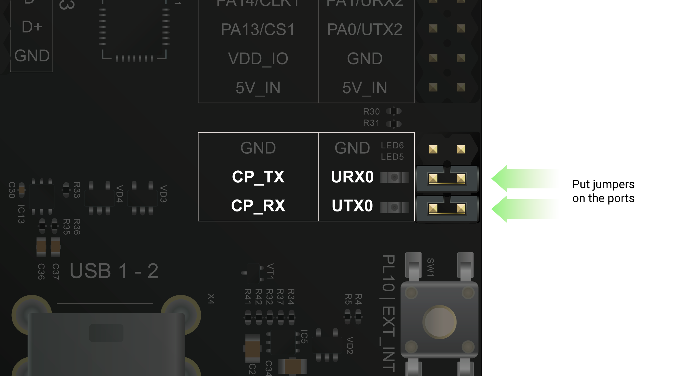
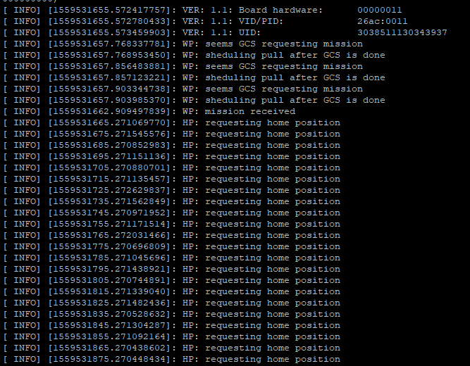

# Neutis N5 Setup

## 1. Bill of Materials

* Neutis N5 Developer Board
* Micro-USB cable
* Heatsink \(to be attached\)



## 2. OS Flashing \(Xenial Xerus\)

Before we can flash a new OS, download the following:

* OS image to be flashed \([Yocto](http://files.emlid.com/neutis/firmware/neutis-image-v1.0.6.zip) / [Xenial](http://files.emlid.com/neutis/firmware/neutis-ubuntu-xenial-image_v1.0.6.zip)\)
* Neutis Manufacturing Flash Tool \([Ubuntu](http://files.emlid.com/flash-tools/linux/neutis-manufacturing-flash-tool_1.2.1_all.deb) / [Windows](http://files.emlid.com/flash-tools/linux/neutis-manufacturing-flash-tool_1.2.1.tar.bz2)\)

### i. Flashing Tool Installation

#### For Ubuntu Users

Use terminal and navigate to directory containing Neutis Manufacturing Flash Tool install file, then run:

```text
sudo dpkg -i neutis-manufacturing-flash-tool_1.2.1_all.deb
```

If successful, flashing tool should appear in applications list

#### For Windows Users

Run the executable file and wait for the installation to complete.

### ii. Entering Flashing \(FEL\) Mode 

Enter FEL mode, by holding 'UBOOT' on the development board, followed by connecting the device to your computer via the 'USB OTG" port as shown below:



### iii. Flash OS Using Neutis Manufacturing Flash Tool

Use the installed GUI application to flash the desired image onto your Neutis development board. Select 'Flashing'  as the work mode and locate the OS image to be flashed.


### iv. Logging In For The 1st Time

Power the devboard through the "Power Console" port. Enter the following details when the login prompt appears.

```text
login: root
password: root
```

Change the default password as necessary.

## 3. Adding User Accounts

While in `root` replace username with the desired login name.

```text
adduser username
```

Enter the password to be used for this account, and leave the other forms blank.

To give the user access to admin privileges, edit the `sudoers` file. You must be in `root` to perform this task, as other user accounts do not possess the required privileges.

```text
cd /etc
sudo -s

#visudo is used to edit 'sudoers'
visudo
```

Once inside, give the user account sudo privileges with the following:

```text
neutis_n5 ALL=(ALL:ALL) ALL
```

One extra step is required to enable the installation of files. This command modifies file permissions to allow users/owners to read & write within this folder.

```text
chmod 4755 /usr/bin/sudo
```

## 4. Serial Connectivity

The Neutis N5 has a built-in USB-to-serial converter. To use this feature, use jumpers to short `URX0` and `UTX0` as shown in the diagram. Note that the `GND` pin is  still shorted. Connect your PC to the Neutis devboard via USB using the `POWER CONSOLE` port.




### i. Serial Connection in Windows

Download a telnet client like [PuTTY](https://www.putty.org/) on your PC. Select the serial tab, locate the COM port in Device Manager and set the baud rate to 115200. Hit " Open", press the "Return" key and log on using \(login: root & your set password\).


### ii. Serial Connection in Linux

First, run a scan of available serial devices on your PC in Terminal using:

```text
ls /dev/ttyUSB*
```

Once the correct device number has been determined, connect to the devboard using this command, where \# is replaced by the device's number:

```text
screen /dev/ttyUSB# 115200
```

If `screen` is not available, you may have to install the package using `sudo apt-get install screen` .

## 5. Internet Connectivity \(WiFi\)

Instructions for setting up a WiFi connection on the Neutis devboard.

### i. Connecting To A Wireless Network

Enter this into terminal to view the list of wireless networks:

```text
nmcli device wifi list
```

To connect to a WPA2 network, use:

```text
sudo nmcli device wifi connect "NETWORK_SSID" password "NETWORK_PASSWORD"
```

For open networks, omit the password parameter like so:

```text
sudo nmcli device wifi connect "NETWORK_SSID"
```

For more information on how to connect to other wireless networks, refer to [nmcli documentation](http://manpages.ubuntu.com/manpages/bionic/en/man1/nmcli.1.html).

To view network information, use the `ifconfig` command

### ii. Installing OpenSSH

To enable interfacing with the Neutis devboard over WiFi, the OpenSSH server package must first be installed on the Neutis devboard:

```text
sudo apt update
sudo apt install openssh-server
```

At this point, you may open a remote terminal with PuTTY or other utilities \(e.g. Linux terminal\) `e.g. ssh username@192.168.x.xxxx`. To find your IP address, use the `ifconfig` tool.

### iii. Installing GNU nano \(console editor\)

Modifying configuration files and other documents will require the use of a text editor like GNU nano. You may skip this step and opt to use the default console editor Vim:

```text
sudo apt install nano
```

### iv. OpenSSH Configuration \(optional, if root access is desired\)

OpenSSH has disabled password-based root logins by default for obvious reasons. Re-enable password logins for root accounts by modifying the configuration file, like so:

```text
sudo nano /etc/ssh/sshd_config
```

We will first create a backup copy of the file:

```text
cp /etc/ssh/sshd_config /etc/ssh/sshd_config.factory-defaults
```

Permissions of the file must then be modified:

`sudo chmod a-w /etc/ssh/sshd_config.factory-defaults`

Look for the `PermitRootLogin` parameter, changing it from `prohibit-password` to `yes`. Exit, save and restart the SSH service using this command:

`sudo systemctl restart ssh`

To check if the service is running, use:

`sudo service ssh status`

## 6. Configuration as a Wireless Access Point

The devboard itself can be turned into a wireless access point. To start, we need to first create a `.conf` file in the `/bin` directory, and then provide file modification permissions:

```text
sudo touch wirelessAP.conf
sudo chmod +x wirelessAP.conf
```

Edit the `.conf` file using your preferred text-editor, then enter the following bash script. Change the SSID & password as desired. Save and execute the script. This script is not executed on boot; it must be run manually.

```text
#!/bin/bash

SSID="NeutisN5"
PASSWORD="12345678"

nmcli    con add \
         type wifi \
         ifname wlan0 \
         con-name $SSID \
         autoconnect no \
         ssid $SSID

nmcli    con modify $SSID \
         802-11-wireless.mode ap \
         802-11-wireless.band bg \
         wifi-sec.key-mgmt wpa-psk \
         wifi-sec.proto rsn \
         wifi-sec.pairwise ccmp \
         wifi-sec.group ccmp \
         wifi-sec.psk $PASSWORD \
         ipv4.method shared \
         ipv4.addresses 192.168.42.1/24 \
         ipv6.method ignore

nmcli    con up $SSID
```

## 7. Install ROS

Instructions obtained from this site:



First, the list of sources must be set up:

```text
sudo sh -c 'echo "deb http://packages.ros.org/ros/ubuntu $(lsb_release -sc) main" > /etc/apt/sources.list.d/ros-latest.list'
```

Next, set up the requisite keys for downloading packages:

```text
sudo apt-key adv --keyserver hkp://ha.pool.sks-keyservers.net:80 --recv-key 421C365BD9FF1F717815A3895523BAEEB01FA116
```

Once completed, update your current repository index list with `sudo apt-get update`, then install the barebones ROS package using `sudo apt-get install ros-kinetic-ros-base`.

Should you require the installation of individual ROS packages, use the following command, where \# is the package name:

```text
sudo apt-get install ros-kinetic-#
```

Next, initialise rosdep using `sudo rosdep init` followed by `rosdep update`. Once that's completed, configure the ROS environment to automatically add ROS variables every time a new shell \(UI\) is launched:

```text
echo "source /opt/ros/kinetic/setup.bash" >> ~/.bashrc
source ~/.bashrc
```

Note that this retrieves the `setup.bash` file of the environment you are currently using. For users with multiple ROS distributions, you can use this to change the source:

```text
source /opt/ros/kinetic/setup.bash
```

Now, we need to add `rosinstall` for obtaining source trees meant for other ROS packages:

```text
sudo apt-get install python-rosinstall python-rosinstall-generator python-wstool build-essential
```

## 8. Creating a Catkin Workspace

Catkin is ROS' official build system, a utility for automating program compilation. It maps source resources \(files\) to a target \(executable\), and optimises the compilation process by only rebuilding parts of the program that has changed. A Catkin Workspace is a folder where you modify, build & install Catkin packages. Prior to creating that workspace, we need to first install `catkin_tools`.

First, add the ROS repositories required containing the installation files:

```text
sudo sh -c 'echo "deb http://packages.ros.org/ros/ubuntu `lsb_release -sc` main" > /etc/apt/sources.list.d/ros-latest.list'
wget http://packages.ros.org/ros.key -O - | sudo apt-key add -
```

Then, install `catkin_tools`:

```text
sudo apt-get update
sudo apt-get install python-catkin-tools
```

To create that workspace, enter the following commands:

```text
mkdir -p ~/catkin_ws/src
cd ~/catkin_ws/
catkin build
```

Then, setup your source  `.*sh` file:

```text
source devel/setup.bash
```

To check if the workspace is overlayed properly on the directory you're in, use:

```text
echo $ROS_PACKAGE_PATH
#output path should be "/home/youruser/catkin_ws/src:/opt/ros/kinetic/share"
```

Some other useful utilities:

```text
sudo apt install python-pip
sudo apt install python3-pip
pip install psutil
```


## 9. ~~Install MAVROS \(source installation\)~~ Currently hitches while building, use binary instead



We need to initialise the catkin workspace:

```text
cd catkin_ws/
catkin init
wstool init src
```

Next, while in the `catkin_ws/` directory, install MAVlink:

```text
rosinstall_generator --rosdistro kinetic mavlink | tee /tmp/mavros.rosinstall
rosdep update
```

Then, install MAVROS:

```text
rosinstall_generator --upstream mavros | tee -a /tmp/mavros.rosinstall
rosdep update
wstool merge -t src /tmp/mavros.rosinstall
wstool update -t src -j4
rosdep install --from-paths src --ignore-src -y
```

Install geographic libraries by running this script:

```text
sudo ./src/mavros/mavros/scripts/install_geographiclib_datasets.sh
```

Compile the packages together using:

```text
catkin build -j1
#-j1 option limits the build queue to 1 job at a time
#required since the neutis_n5 has limited memory
```

## 10. Install MAVROS \(binary installation\)

Install MAVROS:

```text
sudo apt-get install ros-kinetic-mavros ros-kinetic-mavros-extras
```

Then install the geoid dataset:

```text
wget https://raw.githubusercontent.com/mavlink/mavros/master/mavros/scripts/install_geographiclib_datasets.sh
sudo chmod x+ ./install_geographiclib_datasets.sh
sudo ./install_geographiclib_datasets.sh
```

## 11. Hardware Wiring

[https://dev.px4.io/en/companion\_computer/pixhawk\_companion.html](https://dev.px4.io/en/companion_computer/pixhawk_companion.html)

Communications between the Pixhawk and onboard computer take place over an asynchronous serial connection \(UART\). The Pixhawk's ports operate at 3.3v but are 5v tolerant. Serial connections are plugged into the "Telem 2" port using [JST-GH connectors \(1.25mm\)](http://www.jst-mfg.com/product/detail_e.php?series=105).

The recommended wiring configuration requires the use of an FTDI USB to TTL [serial converter](https://www.ftdichip.com/Products/Cables/USBTTLSerial.htm). Omit the 5V connection between the converter and Pixhawk. With the exception of GND connections, the TX pin of the FTDI should be connected to the RX pin of the Pixhawk, and so on. Remember to change the `SYS_COMPANION` parameter on the Pixhawk to `921600, 8N1` to enable the use of `TELEM_2`.


Once that's done, connect the FTDI to the devboard. Install the `usbutils` utility:

```text
sudo apt-get update
sudo apt-get install usbutils
```

Then, locate the Pixhawk device `idVendor` & `idProduct` by running the `lsusb` command, in the format `ID xxxx:yyyy` respectively.

We are now going to create a symbolic link between between the Pixhawk and the USB port. Make a new rules file called `99-pixhawk.rules` in the `/etc/udev/rules.d` directory:

```text
sudo nano 99-pixhawk.rules
```

Enter the following, and replace the respective fields:

```text
SUBSYSTEM=="tty", ATTRS{idVendor}=="xxxx", ATTRS{idProduct}=="yyyy", SYMLINK+="ttyPixhawk"
```

Finally, in `root`, add the following permissions to your user account:

```text
usermod -a -G tty ros-user
usermod -a -G dialout ros-user
```

## 12. Testing Connections

To check if the devboard & Pixhawk are configured correctly, run the MAVROS node on the devboard. Replace the `YYYY` & `GCSipaddress` fields with the correct parameters. `YYYY` is dependent on hardware setup. If connecting via a USB-to-UART converter \(FTDI\), then enter `ls /dev/ttyUSB*`. If connecting via pins, enter `ls /dev/ttyACM0`. `GCSipaddress` refers to the IP address of the computer running the ground control station software \(e.g. QGroundControl\).

```text
roslaunch mavros px4.launch fcu_url:=/dev/ttyYYYY:921600 gcs_url:=udp://@GCSipaddress
```

If successful, you should see some prompts beginning to return like so, and QGroundControl should be connected to the Pixhawk over WiFi automatically.



## 13. Cloning a Base Image \(SD card\)

The OS image can be cloned for backups or deployment purposes. For our purposes, we'll be using a SD card to store the system image. Before proceeding, install the `exFAT` utilities package, and ensure the SD card you have is formatted.

```text
sudo apt udpate
sudo apt install exfat-fuse exfat-utils
```

The SD card should be in `exFAT` format, as the system volume easily exceeds 4GB. Prior to inserting the SD card, we also need to locate the correct disk partition to write to using the `fdisk` utility.

```text
sudo fdisk -l
```

Insert the SD card, then run the command again:

```text
sudo fdisk -l
```

A new entry should appear; ensure you obtain the correct path to this entry \(e.g. /dev/mmcblk0p1\), or else you may end up overwriting the wrong partition later.

Next, we have to mount the SD card to a directory. First create the directory, then mount the SD partition:

```text
sudo mkdir /mnt/SD
sudo mount /dev/mmcblk0p1 /mnt/SD
```

Next, create the `.img` file we are going to write to. Feel free to rename the file.

```text
sudo touch /dev/SD/neutis_n5.img
```

Once that's created, we will use the `dd` utility to clone the existing linux partition over. The syntax takes the following format:

```text
dd if=<source> of=<target>
```

`if=` represents the input file directory, while `of=` represents the output file directory. An example is shown below. In simple terms, `dd` will take the entire `mmcblk2` partition and copy it into `neutis_n5.img`.

```text
sudo dd status=progress if=/dev/mmcblk2 of=/mnt/SD/neutis_n5.img

#status=progress is an option that includes file transfer details
```

Once the transfer is complete, unmount the SD card. You can use `df -h` to check view the entire filesystem and their mount directories. For example, a filesystem mounted on `/dev/SD` can be removed using:

```text
sudo umount /dev/SD
```

If you check the filesystems using `df -h`, you'll notice the SD card is longer present.

## 14. Flashing A Cloned Image

Flash the `.img` file obtained under section 13 with the Neutis Manufacturing Flash Tool.

## 15. Transferring Files via SSH


```text
scp neutis_n5@192.168.42.1:<source> <target>
```


